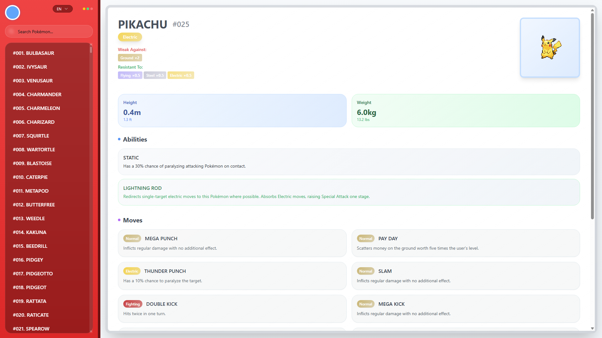

# TetoDex – Pokedex Alternative

[](LICENSE)
[](https://reactjs.org/)
[](https://pokeapi.co/)

---

## 🚀 About TetoDex

**TetoDex** is a modern Pokédex alternative designed for Pokémon enthusiasts.  
Using the [PokeAPI](https://pokeapi.co/), TetoDex allows you to browse Pokémon details including types, stats, abilities, and evolutions, all in a clean and interactive interface reminiscent of a classic Pokédex device.

---

## 🔑 Features

- **Search Pokémon** by name or number  
- **Filter by Type** to explore specific Pokémon types  
- **Visual Evolution Trees** for each Pokémon  
- **Detailed Stats & Abilities** for every Pokémon  
- **Pokedex-like User Interface**, designed for familiar Pokémon navigation  

---

## 🖼️ Screenshots / Demo

<p align="center">
  
</p>

> The interface resembles the classic handheld Pokédex with interactive search and type filters.

---

## 💻 Installation

### Prerequisites

- Node.js v16+
- npm (Node Package Manager)

### Steps

1. Clone the repository:

```bash
git clone https://github.com/WugenTeto/TetoDex--Pokedex-alternative-
cd TetoDex--Pokedex-alternative-
